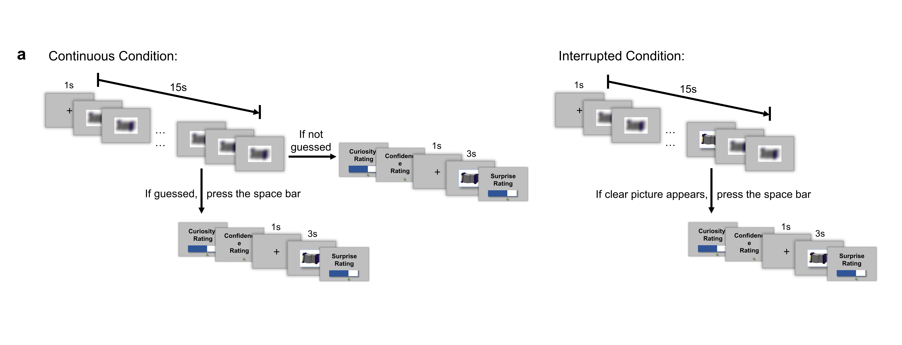

# CuriosityEGI

> From [Affective, Neuroscience, and Decision-making Lab](https://andlab-um.com)

Code for [[EEG study of curiosity]] preprocessing and preliminary analysis, accompanied with the following preprint:

## Abstract
The neural mechanisms of curiosity in humans are a prominent topic in the field, while rare studies uncover the underlying neural mechanisms associated with the process of curiosity and its relief. This study investigates the neural temporal course of curiosity, employing high-density EEG and a two-period blurred picture task to induce and alleviate curiosity in 40 participants. Participants' electroencephalogram (EEG) activity was recorded during the picture task, and the results indicate that the N170 in the central region and the P300 in the partial are modulated by different levels of curiosity. Both N170 and P300 amplitude correlated with surprise ratings, with P300 amplitude showing a correlation with subject-level anxiety. Our findings offer valuable insights into the temporal dynamics of curiosity within the human brain, shedding light on the cognitive processes and emotions involved in the induction and alleviation of curiosity.

## Experiments
 The task consisted of three main phases: blurred picture presentation phase, self-evaluation phase, clear picture presentation phase. In the blurred picture presentation phase, participants viewed a gradually deblurring image and were instructed to press the space when they thought they recognized the image. Alternatively, they could opt not to press the space bar if no recognition occurred.
Following the blurred picture presentation, participants engaged in a self-evaluation phase, rating their curiosity towards the blurred picture on a 6-point scale and their confidence in their guesses on a 10-point scale. In the clear picture presentation phase, participants viewed the actual clear picture and rated their surprise on a 6-point scale.
In intrupped trials, the blurred picture will abruptly turned clear, prompting an immediate response. Participants then proceeded to the self-evaluation phase. The timing of these interruptions was pseudo-randomized. Participants consistently rated their curiosity and confidence, even in interrupted trials, based on their feelings after seeing the clear picture. In the contionus trials, participants will see the gradually deblurring picture. The purpose of interrupted trials is to observe participants' neural responses and behavioral reactions when faced with sudden changes in circumstances. This design helps researchers gain insights into the neural foundations of curiosity, particularly in response to the unknown or unexpected events. 

## History 
01/14/2023- Initaion date

## Path and code
The Behavioral Result is in the curi_behav_lxq.csv. The EGI data will be uploading soon.
